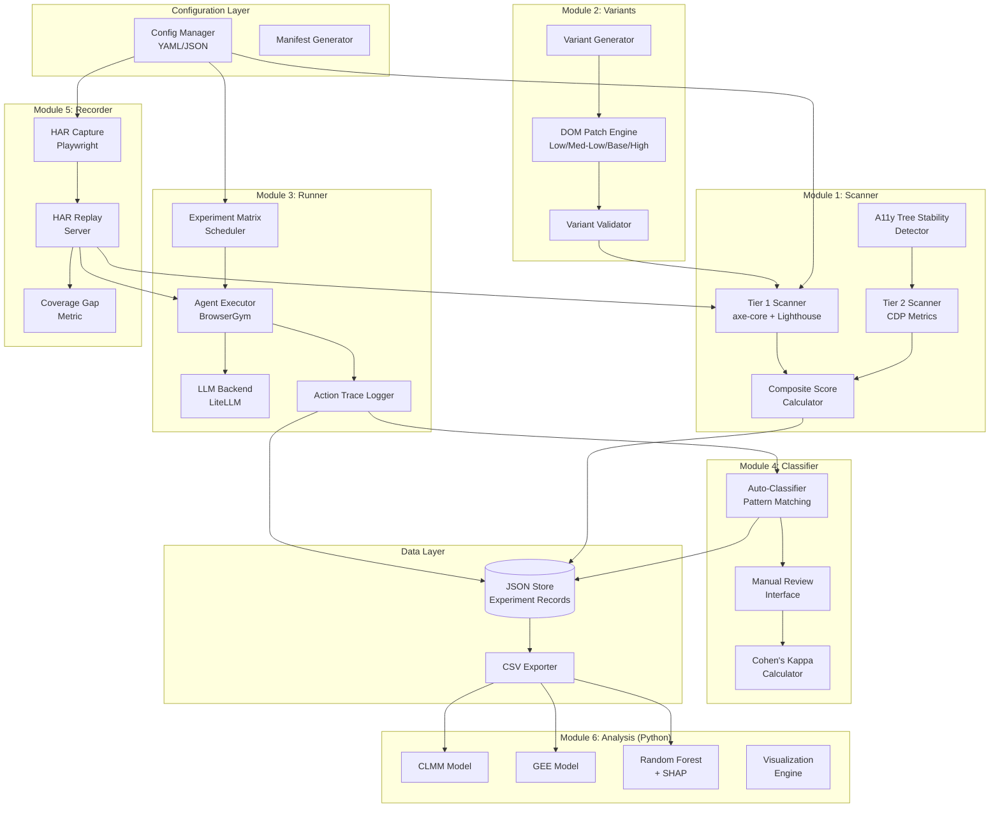
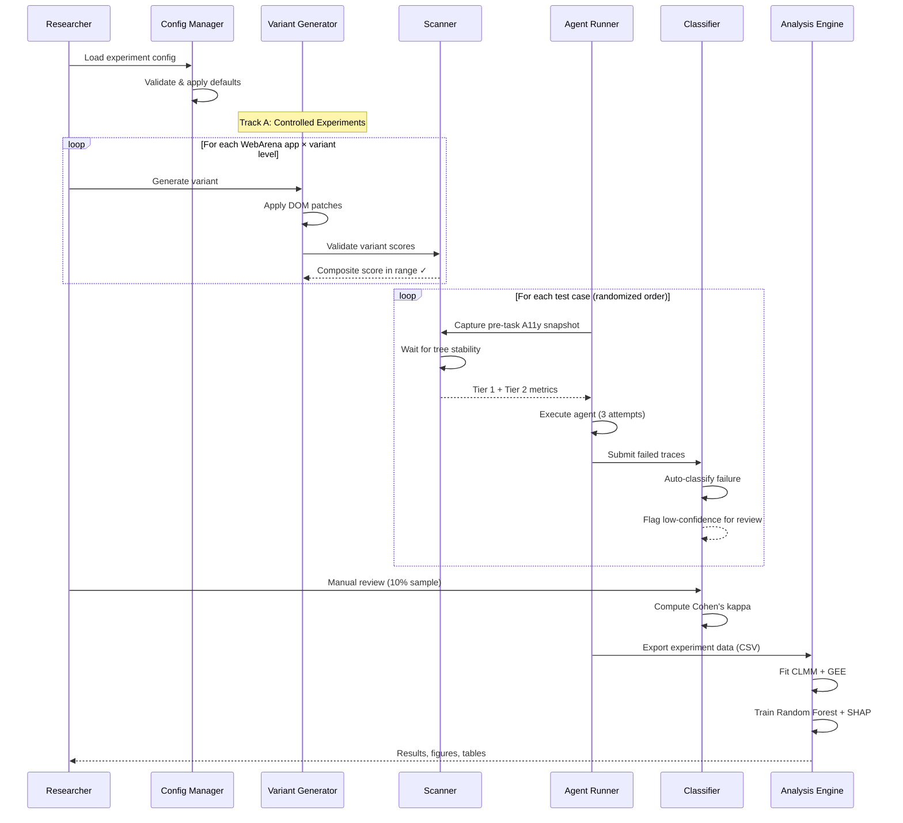
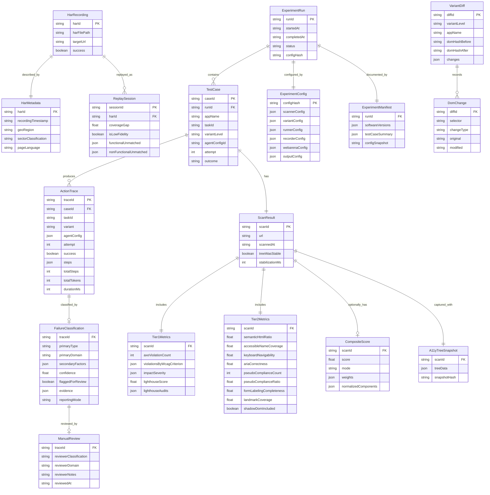

# Technical Design: AI Agent Accessibility Platform

## Overview

This document describes the technical design for an empirical research platform studying the relationship between web accessibility and AI agent task success, targeting CHI 2027 / ASSETS 2027. The platform tests the "Same Barrier" hypothesis: AI agents and screen reader users face structurally equivalent barriers because both depend on the browser Accessibility Tree.

The platform implements a dual-track research design:
- **Track A**: Controlled experiments on WebArena self-hosted apps with four accessibility variant levels (Low → High)
- **Track B**: Ecological survey of 50+ real-world websites via HAR recording and replay

Six modules compose the platform:

| Module | Language | Purpose |
|--------|----------|---------|
| Scanner (M1) | TypeScript/Node.js | Tier 1 (axe-core + Lighthouse) and Tier 2 (novel CDP-based) accessibility measurement |
| Variants (M2) | TypeScript/Node.js | WebArena DOM manipulation to create four accessibility variant levels |
| Runner (M3) | TypeScript/Node.js + Python (BrowserGym) | Agent execution engine with action trace logging |
| Classifier (M4) | TypeScript/Node.js | Failure attribution across 11-type taxonomy |
| Recorder (M5) | TypeScript/Node.js | HAR capture and replay pipeline for Track B |
| Analysis (M6) | Python | CLMM, GEE, Random Forest + SHAP statistical analysis |

## Architecture

### High-Level System Architecture



### Execution Flow



### Module Communication

Modules communicate through well-defined TypeScript interfaces and JSON data files. There is no runtime RPC between modules — they are orchestrated sequentially by the experiment matrix scheduler (Module 3) and share data via the filesystem-based JSON store.

The Python Analysis Engine (Module 6) consumes CSV exports produced by the data export layer, maintaining a clean language boundary.


## Components and Interfaces

### Module 1: Scanner

#### Tier 1 Scanner (`scanner/tier1/`)

Wraps `@axe-core/playwright` and Lighthouse Node API to produce standardized accessibility metrics.

```typescript
interface Tier1ScanOptions {
  url: string;
  wcagLevels: ('A' | 'AA' | 'AAA')[];  // Req 1.5
  lighthouseFlags?: LighthouseFlags;
}

interface AxeCoreResult {
  violationCount: number;
  violationsByWcagCriterion: Record<string, AxeViolation[]>;  // e.g. "4.1.2" → violations
  impactSeverity: Record<'critical' | 'serious' | 'moderate' | 'minor', number>;
}

interface LighthouseResult {
  accessibilityScore: number;  // 0–100
  audits: Record<string, { pass: boolean; details?: unknown }>;
}

interface Tier1Metrics {
  url: string;
  axeCore: AxeCoreResult;
  lighthouse: LighthouseResult;
  scannedAt: string;  // ISO 8601
}

// Req 1.4: Errors are logged, not thrown — returns partial results
async function scanTier1(page: Page, options: Tier1ScanOptions): Promise<Tier1Metrics>;
```

Implementation approach:
- `@axe-core/playwright` runs in-page via `AxeBuilder(page).withTags(wcagLevels).analyze()`
- Lighthouse runs via `lighthouse(url, { onlyCategories: ['accessibility'] })` using the Node API with a shared Playwright browser CDP session
- Both run concurrently via `Promise.allSettled()` — if one fails, the other's results are still returned (Req 1.4)

#### Tier 2 Scanner (`scanner/tier2/`)

Computes novel functional metrics using Playwright DOM queries and CDP.

```typescript
interface Tier2Metrics {
  semanticHtmlRatio: number;         // Req 2.1
  accessibleNameCoverage: number;    // Req 2.2
  keyboardNavigability: number;      // Req 2.3
  ariaCorrectness: number;           // Req 2.4
  pseudoComplianceCount: number;     // Req 2.5 (absolute count)
  pseudoComplianceRatio: number;     // Req 2.5 (as ratio)
  formLabelingCompleteness: number;  // Req 2.6
  landmarkCoverage: number;          // Req 2.7
  shadowDomIncluded: boolean;        // Req 2.8
}

async function scanTier2(page: Page, cdpSession: CDPSession): Promise<Tier2Metrics>;
```

Key implementation details:

- **Semantic HTML ratio** (Req 2.1): `page.$$eval('nav,main,header,footer,article,section,aside,figure,figcaption,details,summary,dialog,time,mark,address', els => els.length)` divided by `page.$$eval('*', els => els.length)`. Shadow DOM traversal via recursive `element.shadowRoot.querySelectorAll('*')`.

- **Accessible name coverage** (Req 2.2): Use `cdpSession.send('Accessibility.getFullAXTree')` to get the full accessibility tree. Filter nodes with interactive roles (button, link, textbox, combobox, checkbox, etc.). Check each for non-empty `name` property.

- **Keyboard navigability** (Req 2.3): Programmatic tab cycle — `page.keyboard.press('Tab')` in a loop, tracking `document.activeElement` at each step. Count elements that receive `:focus-visible` (via `window.getComputedStyle(el).outlineStyle !== 'none'` or checking the `:focus-visible` pseudo-class). Ratio = focused elements / total focusable elements. Safety guards: max 200 Tab presses, 30-second timeout, and keyboard trap detection (if focus stays on the same element for 5 consecutive Tab presses, flag as trapped and break). Tab cycle completes when focus returns to the starting element or reaches `document.body`.

- **ARIA correctness** (Req 2.4): Query all elements with `[role]` or `[aria-*]` attributes. Validate against WAI-ARIA 1.2 spec: required owned elements, required states/properties, allowed attributes per role. Score = valid elements / total ARIA-annotated elements.

- **Pseudo-compliance detection** (Req 2.5): For elements with interactive ARIA roles (`button`, `link`, `checkbox`, `tab`, `menuitem`), use `cdpSession.send('DOMDebugger.getEventListeners', { objectId })` to check for `click`, `keydown`, or `keyup` listeners. Elements with role but no handlers are pseudo-compliant.

- **Form labeling** (Req 2.6): For each `input`, `select`, `textarea`: check for `<label for="id">`, `aria-label`, or `aria-labelledby`. Ratio = labeled / total.

- **Landmark coverage** (Req 2.7): Get all text nodes, determine which are inside landmark regions (`[role=banner]`, `[role=navigation]`, `[role=main]`, `[role=contentinfo]`, `<nav>`, `<main>`, `<header>`, `<footer>`, `<aside>`, `<form>`, `<section[aria-label]>`). Ratio = text length inside landmarks / total visible text length.

- **Shadow DOM** (Req 2.8): All metric functions accept a `traverseShadowDOM: boolean` flag (default true). When enabled, use `page.evaluate()` with recursive shadow root traversal to collect elements from shadow trees.

#### A11y Tree Stability Detector (`scanner/snapshot/`)

```typescript
interface StabilityOptions {
  intervalMs: number;    // default 2000
  timeoutMs: number;     // default 30000
  maxRetries: number;    // default 3 (derived from timeout/interval)
}

interface StabilityResult {
  stable: boolean;
  snapshot: AccessibilityTreeSnapshot;
  stabilizationMs: number;
  attempts: number;
}

async function waitForA11yTreeStable(
  page: Page,
  options?: Partial<StabilityOptions>
): Promise<StabilityResult>;
```

Comparison algorithm: Serialize the A11y tree (via `page.accessibility.snapshot()`) to a canonical JSON string, then compare SHA-256 hashes of consecutive snapshots. Two identical hashes = stable.

#### Composite Score Calculator (Supplementary)

Used for variant validation sanity checks and supplementary interpretability reporting.
Primary statistical analysis (Module 6) uses criterion-level feature vectors, not this composite.

```typescript
type SensitivityMode = 'tier1-only' | 'tier2-only' | 'composite';

interface CompositeScoreOptions {
  weights: Record<string, number>;  // metric name → weight
  mode: SensitivityMode;
}

interface CompositeScoreResult {
  compositeScore: number;  // 0.0–1.0
  normalizedComponents: Record<string, number>;
  mode: SensitivityMode;
  weights: Record<string, number>;
}

function computeCompositeScore(
  tier1: Tier1Metrics,
  tier2: Tier2Metrics,
  options: CompositeScoreOptions
): CompositeScoreResult;
```

Normalization: Lighthouse score divided by 100, axe violation count inverted (1 - min(count/maxExpected, 1)), Tier 2 metrics already 0–1. Weighted sum with configurable weights.


### Module 2: Variant Generator

#### DOM Patch Engine (`variants/patches/`)

```typescript
type VariantLevel = 'low' | 'medium-low' | 'base' | 'high';

interface DomChange {
  selector: string;
  changeType: 'replace' | 'remove-attr' | 'add-attr' | 'remove-element' | 'add-element' | 'remove-handler';
  original: string;   // serialized original state
  modified: string;   // serialized modified state
}

interface VariantDiff {
  variantLevel: VariantLevel;
  appName: string;
  changes: DomChange[];
  domHashBefore: string;  // SHA-256 of serialized DOM
  domHashAfter: string;
}

async function applyVariant(
  page: Page,
  level: VariantLevel,
  appName: string
): Promise<VariantDiff>;

async function revertVariant(
  page: Page,
  diff: VariantDiff
): Promise<{ success: boolean; domHashAfterRevert: string }>;
```

Variant manipulation strategies:

- **Low (Level 0)**: `page.evaluate()` script that:
  1. Replaces `<nav>`, `<main>`, `<header>`, `<footer>`, `<article>`, `<section>`, `<aside>` with `<div>`
  2. Removes all `aria-*` attributes and `role` attributes
  3. Removes all `<label>` elements and `for` attributes
  4. Removes `keydown`, `keyup`, `keypress` event listeners via `getEventListeners()` + `removeEventListener()`
  5. Wraps interactive elements in closed Shadow DOM to hide them from the A11y tree

- **Medium-Low (Level 1)**: `page.evaluate()` script that models the most common real-world inaccessible state:
  1. Preserves `role` attributes on interactive elements but removes ~50% of their `keydown`/`keyup` handlers (creating pseudo-compliance — role present, handler absent)
  2. Replaces ~40% of semantic HTML elements (`<button>`, `<nav>`, `<section>`) with `<div>` equivalents, keeping the rest intact (mixed semantic/non-semantic DOM)
  3. Removes `for` attribute from ~50% of `<label>` elements (partial form label association)
  4. Keeps existing landmark `aria-label` values unchanged (real sites don't randomize labels); removes `aria-label` from ~30% of landmarks instead

- **Base (Level 1.5)**: No-op — returns the unmodified DOM with an empty diff.

- **High (Level 2)**: `page.evaluate()` script that:
  1. Adds `aria-label` to all interactive elements missing accessible names
  2. Inserts skip-navigation link (`<a href="#main-content" class="skip-link">Skip to main content</a>`)
  3. Ensures all `<input>`, `<select>`, `<textarea>` have associated `<label>` or `aria-label`
  4. Adds `role="banner"`, `role="navigation"`, `role="main"`, `role="contentinfo"` to appropriate page sections
  5. Fixes all axe-core violations that have automated remediation

#### Variant Validator (`variants/validation/`)

```typescript
interface VariantValidationResult {
  variantLevel: VariantLevel;
  compositeScore: CompositeScoreResult;
  inExpectedRange: boolean;
  expectedRange: { min: number; max: number };
}

// Expected composite score ranges per variant level
const VARIANT_SCORE_RANGES: Record<VariantLevel, { min: number; max: number }> = {
  'low':        { min: 0.0, max: 0.25 },
  'medium-low': { min: 0.25, max: 0.50 },
  'base':       { min: 0.40, max: 0.70 },
  'high':       { min: 0.75, max: 1.0 },
};

async function validateVariant(
  page: Page,
  level: VariantLevel,
  scanner: Scanner
): Promise<VariantValidationResult>;
```

### Module 3: Agent Runner

#### Agent Executor (`runner/agents/`)

```typescript
type ObservationMode = 'text-only' | 'vision';
type LlmBackend = 'claude-opus' | 'gpt-4o' | string;

interface AgentConfig {
  observationMode: ObservationMode;
  llmBackend: LlmBackend;
  maxSteps: number;          // default 30
  retryCount: number;        // default 3
  retryBackoffMs: number;    // default 1000 (exponential)
  temperature: number;       // default 0.0 for reproducibility
}

interface ActionTraceStep {
  stepNum: number;
  timestamp: string;
  observation: string;       // A11y tree text or screenshot path
  reasoning: string;         // LLM chain-of-thought
  action: string;            // e.g. "click(element='Submit button')"
  result: 'success' | 'failure' | 'error';
  resultDetail?: string;
}

interface ActionTrace {
  taskId: string;
  variant: VariantLevel;
  agentConfig: AgentConfig;
  attempt: number;
  success: boolean;
  steps: ActionTraceStep[];
  totalSteps: number;
  totalTokens: number;
  durationMs: number;
  failureType?: string;
  failureConfidence?: number;
}

interface TaskOutcome {
  taskId: string;
  outcome: 'success' | 'partial_success' | 'failure' | 'timeout';
  traces: ActionTrace[];     // one per attempt
  medianSteps: number;
  medianDurationMs: number;
  scanResults: ScanResult;
}
```

#### LLM Backend Adapter (`runner/backends/`)

```typescript
interface LlmRequest {
  model: string;
  messages: Array<{ role: string; content: string | object[] }>;
  temperature: number;
  maxTokens: number;
}

interface LlmResponse {
  content: string;
  tokensUsed: { prompt: number; completion: number };
  model: string;
  latencyMs: number;
}

// Uses LiteLLM as a unified proxy
async function callLlm(
  request: LlmRequest,
  retryConfig: { maxRetries: number; backoffMs: number }
): Promise<LlmResponse>;
```

LiteLLM integration: The platform runs LiteLLM as a local proxy server. All LLM calls go through `http://localhost:4000/v1/chat/completions` with the model name prefix determining the backend (e.g., `claude-3-opus-20240229`, `gpt-4o`). Exponential backoff: delay = `backoffMs * 2^attempt`.

#### Experiment Matrix Scheduler (`runner/`)

```typescript
interface ExperimentMatrix {
  apps: string[];                    // ['reddit', 'gitlab', 'cms', 'ecommerce']
  variants: VariantLevel[];          // ['low', 'medium-low', 'base', 'high']
  tasksPerApp: Record<string, string[]>;  // app → task IDs
  agentConfigs: AgentConfig[];
  repetitions: number;               // default 3
}

interface ExperimentRun {
  runId: string;
  matrix: ExperimentMatrix;
  executionOrder: string[];          // randomized test case IDs
  completedCases: Set<string>;       // for resume support
  startedAt: string;
  status: 'running' | 'completed' | 'interrupted';
}

async function executeExperiment(
  matrix: ExperimentMatrix,
  resumeFrom?: string  // runId to resume
): Promise<ExperimentRun>;
```

Randomization: Fisher-Yates shuffle on the flattened test case list. Resume support: persist `completedCases` to disk after each test case; on resume, skip completed cases.


### Module 4: Failure Classifier

#### Auto-Classifier (`classifier/taxonomy/`)

```typescript
type FailureDomain = 'accessibility' | 'model' | 'environmental' | 'task';

type FailureType =
  // Accessibility domain
  | 'F_ENF'   // Element not found (missing label/name)
  | 'F_WEA'   // Wrong element actuation
  | 'F_KBT'   // Keyboard trap
  | 'F_PCT'   // Pseudo-compliance trap
  | 'F_SDI'   // Shadow DOM invisible
  // Model domain
  | 'F_HAL'   // Hallucination
  | 'F_COF'   // Context overflow
  | 'F_REA'   // Reasoning error
  // Environmental domain
  | 'F_ABB'   // Anti-bot block
  | 'F_NET'   // Network timeout
  // Task domain
  | 'F_AMB';  // Task ambiguity

interface FailureClassification {
  primary: FailureType;
  primaryDomain: FailureDomain;
  secondaryFactors: FailureType[];
  confidence: number;           // 0.0–1.0
  flaggedForReview: boolean;    // true if confidence < 0.7
  evidence: string[];           // trace entries supporting classification
}

type ReportingMode = 'conservative' | 'inclusive';

function classifyFailure(trace: ActionTrace): FailureClassification;
```

Pattern matching rules (Req 9.2):

| Pattern | Failure Type | Detection Logic |
|---------|-------------|-----------------|
| ≥3 consecutive failed selectors targeting same element | F_ENF | Count sequential `result: 'failure'` steps with similar `action` targets |
| Agent clicks element that doesn't match intended target | F_WEA | Compare action target name with task goal context |
| Tab key pressed ≥2× returning to same element | F_KBT | Detect cycles in focus sequence from observation |
| Element has role but action fails with "not interactive" | F_PCT | Match role presence + handler absence pattern |
| Agent references element not in A11y tree but visible in screenshot | F_SDI | Compare A11y tree content with screenshot OCR (if available) |
| Agent performs action on non-existent element | F_HAL | Action target not found in any observation |
| Token count exceeds context window | F_COF | Check `totalTokens` against model context limit |
| Agent's reasoning contradicts observation | F_REA | Heuristic: action doesn't follow from stated reasoning |
| HTTP 403/429 in action results | F_ABB | Match HTTP status codes in results |
| Timeout or connection errors | F_NET | Match timeout/network error patterns |
| Agent asks for clarification or states task is unclear | F_AMB | NLP pattern match on reasoning text |

#### Manual Review Interface (`classifier/review/`)

```typescript
interface ReviewItem {
  traceId: string;
  actionTrace: ActionTrace;
  autoClassification: FailureClassification;
  pageScreenshot?: string;       // path to screenshot
  a11yTreeSnapshot?: string;     // serialized A11y tree
}

interface ManualReview {
  traceId: string;
  reviewerClassification: FailureType;
  reviewerDomain: FailureDomain;
  reviewerNotes: string;
  reviewedAt: string;
}

interface InterRaterResult {
  cohensKappa: number;
  agreementRate: number;
  confusionMatrix: Record<FailureType, Record<FailureType, number>>;
  sampleSize: number;
}

function selectForReview(
  classifications: FailureClassification[],
  sampleRate: number  // default 0.10
): ReviewItem[];

function computeCohensKappa(
  autoClassifications: FailureClassification[],
  manualReviews: ManualReview[]
): InterRaterResult;
```

The manual review interface is a CLI tool that presents each review item sequentially, showing the trace, auto-classification, and page state. The reviewer selects a failure type and optionally adds notes.

### Module 5: HAR Recorder

#### HAR Capture (`recorder/capture/`)

```typescript
interface HarCaptureOptions {
  urls: string[];
  waitAfterLoadMs: number;     // default 10000
  concurrency: number;         // default 5
  outputDir: string;
}

interface HarMetadata {
  recordingTimestamp: string;
  targetUrl: string;
  geoRegion: string;
  sectorClassification: string;
  pageLanguage: string;
}

interface HarCaptureResult {
  harFilePath: string;
  metadata: HarMetadata;
  success: boolean;
  error?: string;
}

async function captureHar(options: HarCaptureOptions): Promise<HarCaptureResult[]>;
```

Implementation: Uses Playwright's `page.routeFromHAR(harPath, { update: true })` in recording mode. After navigation, waits `waitAfterLoadMs` for dynamic content, then saves the HAR file. Metadata is extracted from response headers (`Content-Language`) and stored as a sidecar JSON file.

#### HAR Replay Server (`recorder/replay/`)

```typescript
interface HarReplayOptions {
  harFilePath: string;
  unmatchedRequestBehavior: 'return-404' | 'passthrough';
}

interface ReplaySession {
  page: Page;
  coverageGap: number;              // 0.0–1.0 (functional requests only)
  functionalUnmatched: string[];    // HTML, JS, CSS, API requests that missed
  nonFunctionalUnmatched: string[]; // analytics, ads, tracking pixels that missed
  totalUnmatched: string[];         // all unmatched for logging
  isLowFidelity: boolean;           // true if functional coverageGap > 0.20
}

async function createReplaySession(
  browser: Browser,
  options: HarReplayOptions
): Promise<ReplaySession>;
```

Implementation: Uses Playwright's `page.routeFromHAR(harPath)` for replay. Intercepts unmatched requests via a fallback route handler that returns 404 and logs the URL. Requests are classified as functional (HTML, JS, CSS, API endpoints) or non-functional (analytics, ads, tracking pixels — matched by domain patterns like `google-analytics.com`, `doubleclick.net`, `facebook.com/tr`, etc.). Coverage gap is computed only over functional requests to avoid penalizing SPAs with heavy analytics traffic.

### Module 6: Analysis Engine (Python)

```python
# analysis/models/primary.py
class PrimaryAnalysis:
    """CLMM and GEE models for primary research question."""

    def fit_clmm(self, data: pd.DataFrame) -> CLMMResult:
        """
        Fit mixed-effects logistic regression for Track A.
        DV: agent_success (binary: 0/1)
        IV: a11y_variant_level (ordinal, 4 levels: Low/Med-Low/Base/High)
        Random effects: (1|app), (1|llm_backend)

        Note: CLMM (ordinal DV) is used only if task outcome is
        three-level (failure/partial/success). Default is binary logistic.
        """
        ...

    def fit_gee(self, data: pd.DataFrame) -> GEEResult:
        """
        Fit GEE with logit link for Track B.
        DV: agent_success (binary: 0/1)
        IV: criterion-level Tier 1+2 feature vector (NOT Composite_Score)
        Random intercepts: (1|website), (1|llm_backend)
        """
        ...

    def interaction_effect(self, data: pd.DataFrame) -> InteractionResult:
        """
        Test a11y_variant × observation_mode interaction.
        Expected: Text-Only agents show strong A11y gradient;
        Vision agents show weak/null gradient (bypasses A11y Tree).
        If confirmed → strongest evidence for A11y Tree as causal mechanism.
        """
        ...

    def sensitivity_analysis(self, data: pd.DataFrame) -> SensitivityResult:
        """
        Run models with tier1-only, tier2-only, and supplementary composite.
        Primary analysis always uses criterion-level feature vectors.
        """
        ...

    def post_hoc_power(self, data: pd.DataFrame, target_effect: float) -> PowerResult:
        """Post-hoc power analysis after pilot phase."""
        ...

# analysis/models/secondary.py
class SecondaryAnalysis:
    """Random Forest + SHAP for secondary research question."""

    def train_random_forest(self, X: pd.DataFrame, y: pd.Series) -> RFResult:
        """
        Features: individual WCAG criterion pass/fail indicators
        Target: agent success (binary)
        """
        ...

    def compute_shap(self, model, X: pd.DataFrame) -> SHAPResult:
        """SHAP values for each WCAG criterion."""
        ...

    def partial_dependence_plots(self, model, X: pd.DataFrame, top_n: int = 10):
        """Generate PDP for top N most important criteria."""
        ...

# analysis/viz/figures.py
class FigureGenerator:
    """Paper-ready figures for CHI/ASSETS submission."""

    def variant_success_heatmap(self, data: pd.DataFrame) -> Figure: ...
    def shap_summary_plot(self, shap_values, features: pd.DataFrame) -> Figure: ...
    def interaction_effect_plot(self, data: pd.DataFrame) -> Figure: ...
    def failure_taxonomy_sankey(self, classifications: pd.DataFrame) -> Figure: ...
```

Libraries: `statsmodels` (GEE), `ordinal` via `rpy2` or `mord` (CLMM), `scikit-learn` (Random Forest), `shap`, `matplotlib`/`seaborn` (visualization).

### Cross-Cutting: Configuration Manager

```typescript
interface ExperimentConfig {
  // Scanner config
  scanner: {
    wcagLevels: ('A' | 'AA' | 'AAA')[];
    stabilityIntervalMs: number;
    stabilityTimeoutMs: number;
    concurrency: number;
  };
  // Variant config
  variants: {
    levels: VariantLevel[];
    scoreRanges: Record<VariantLevel, { min: number; max: number }>;
  };
  // Runner config
  runner: {
    agentConfigs: AgentConfig[];
    repetitions: number;
    maxSteps: number;
    concurrency: number;
  };
  // Recorder config
  recorder: {
    waitAfterLoadMs: number;
    concurrency: number;
  };
  // WebArena config
  webarena: {
    apps: Record<string, { url: string; resetEndpoint?: string }>;
  };
  // Output config
  output: {
    dataDir: string;
    exportFormats: ('json' | 'csv')[];
  };
}

function loadConfig(filePath: string): ExperimentConfig;
function validateConfig(config: unknown): { valid: boolean; errors: string[] };
```

### Cross-Cutting: Data Export

```typescript
interface ExperimentManifest {
  runId: string;
  startedAt: string;
  completedAt: string;
  config: ExperimentConfig;
  softwareVersions: {
    axeCore: string;
    lighthouse: string;
    playwright: string;
    llmModels: Record<string, string>;
    platform: string;
  };
  testCases: Array<{
    caseId: string;
    outcome: string;
    traces: number;
  }>;
}

interface CsvExportOptions {
  anonymize: boolean;              // Req 15.4: strip PII from HAR data
  anonymizeSiteIdentity: boolean;  // Replace URLs with opaque IDs (e.g. site_001) for public release
  includeTraceDetails: boolean;
}

function generateManifest(run: ExperimentRun): ExperimentManifest;
function exportToCsv(records: ExperimentRecord[], options: CsvExportOptions): string[];
```

PII anonymization (Req 15.4): Regex-based scrubbing of cookies, auth tokens, email addresses, and user-specific URL path segments from HAR metadata before CSV export. When `anonymizeSiteIdentity` is enabled, all website URLs are replaced with opaque identifiers (e.g., `site_001`, `site_002`) and a private mapping file is stored separately — per proposal, individual site A11y scores are reported only in aggregate by sector/geography in public releases.


## Data Models

### Core Data Entities



### File System Layout

```
data/
├── track-a/
│   ├── runs/
│   │   └── {runId}/
│   │       ├── manifest.json           # ExperimentManifest
│   │       ├── config.json             # Frozen ExperimentConfig
│   │       ├── progress.json           # completedCases for resume
│   │       └── cases/
│   │           └── {caseId}/
│   │               ├── scan-result.json
│   │               ├── a11y-snapshot.json
│   │               ├── trace-attempt-1.json
│   │               ├── trace-attempt-2.json
│   │               ├── trace-attempt-3.json
│   │               ├── classification.json
│   │               └── screenshot.png
│   └── variants/
│       └── {appName}/
│           └── {variantLevel}/
│               └── diff.json           # VariantDiff
├── track-b/
│   ├── har/
│   │   └── {harId}/
│   │       ├── recording.har
│   │       ├── metadata.json
│   │       └── scan-result.json
│   └── runs/
│       └── {runId}/
│           └── ...                     # Same structure as track-a/runs
├── pilot/
│   └── ...                             # Same structure, 20 sites
├── reviews/
│   ├── review-batch-{batchId}.json     # ManualReview records
│   └── kappa-results.json              # InterRaterResult
└── exports/
    ├── experiment-data.csv
    ├── scan-metrics.csv
    ├── failure-classifications.csv
    └── trace-summaries.csv
```

### JSON Schema: Scan Result (Serialization Target)

```json
{
  "$schema": "http://json-schema.org/draft-07/schema#",
  "type": "object",
  "required": ["scanId", "url", "scannedAt", "tier1", "tier2", "a11yTreeSnapshot"],
  "properties": {
    "scanId": { "type": "string", "format": "uuid" },
    "url": { "type": "string", "format": "uri" },
    "scannedAt": { "type": "string", "format": "date-time" },
    "treeWasStable": { "type": "boolean" },
    "stabilizationMs": { "type": "integer", "minimum": 0 },
    "tier1": {
      "type": "object",
      "required": ["axeViolationCount", "violationsByWcagCriterion", "impactSeverity", "lighthouseScore"],
      "properties": {
        "axeViolationCount": { "type": "integer", "minimum": 0 },
        "violationsByWcagCriterion": { "type": "object" },
        "impactSeverity": {
          "type": "object",
          "properties": {
            "critical": { "type": "integer" },
            "serious": { "type": "integer" },
            "moderate": { "type": "integer" },
            "minor": { "type": "integer" }
          }
        },
        "lighthouseScore": { "type": "number", "minimum": 0, "maximum": 100 },
        "lighthouseAudits": { "type": "object" }
      }
    },
    "tier2": {
      "type": "object",
      "required": ["semanticHtmlRatio", "accessibleNameCoverage", "keyboardNavigability", "ariaCorrectness", "formLabelingCompleteness", "landmarkCoverage"],
      "properties": {
        "semanticHtmlRatio": { "type": "number", "minimum": 0, "maximum": 1 },
        "accessibleNameCoverage": { "type": "number", "minimum": 0, "maximum": 1 },
        "keyboardNavigability": { "type": "number", "minimum": 0, "maximum": 1 },
        "ariaCorrectness": { "type": "number", "minimum": 0, "maximum": 1 },
        "pseudoComplianceCount": { "type": "integer", "minimum": 0 },
        "pseudoComplianceRatio": { "type": "number", "minimum": 0, "maximum": 1 },
        "formLabelingCompleteness": { "type": "number", "minimum": 0, "maximum": 1 },
        "landmarkCoverage": { "type": "number", "minimum": 0, "maximum": 1 },
        "shadowDomIncluded": { "type": "boolean" }
      }
    },
    "compositeScore": {
      "type": ["object", "null"],
      "properties": {
        "score": { "type": "number", "minimum": 0, "maximum": 1 },
        "mode": { "enum": ["tier1-only", "tier2-only", "composite"] },
        "weights": { "type": "object" },
        "normalizedComponents": { "type": "object" }
      }
    },
    "a11yTreeSnapshot": { "type": "object" }
  }
}
```

### JSON Schema: Action Trace (Serialization Target)

```json
{
  "$schema": "http://json-schema.org/draft-07/schema#",
  "type": "object",
  "required": ["traceId", "taskId", "variant", "agentConfig", "attempt", "success", "steps", "totalSteps", "totalTokens", "durationMs"],
  "properties": {
    "traceId": { "type": "string", "format": "uuid" },
    "taskId": { "type": "string" },
    "variant": { "enum": ["low", "medium-low", "base", "high"] },
    "agentConfig": {
      "type": "object",
      "required": ["observationMode", "llmBackend"],
      "properties": {
        "observationMode": { "enum": ["text-only", "vision"] },
        "llmBackend": { "type": "string" },
        "maxSteps": { "type": "integer" },
        "retryCount": { "type": "integer" },
        "temperature": { "type": "number" }
      }
    },
    "attempt": { "type": "integer", "minimum": 1 },
    "success": { "type": "boolean" },
    "steps": {
      "type": "array",
      "items": {
        "type": "object",
        "required": ["stepNum", "timestamp", "observation", "reasoning", "action", "result"],
        "properties": {
          "stepNum": { "type": "integer", "minimum": 1 },
          "timestamp": { "type": "string", "format": "date-time" },
          "observation": { "type": "string" },
          "reasoning": { "type": "string" },
          "action": { "type": "string" },
          "result": { "enum": ["success", "failure", "error"] },
          "resultDetail": { "type": "string" }
        }
      }
    },
    "totalSteps": { "type": "integer", "minimum": 0 },
    "totalTokens": { "type": "integer", "minimum": 0 },
    "durationMs": { "type": "integer", "minimum": 0 },
    "failureType": { "type": "string" },
    "failureConfidence": { "type": "number", "minimum": 0, "maximum": 1 }
  }
}
```

