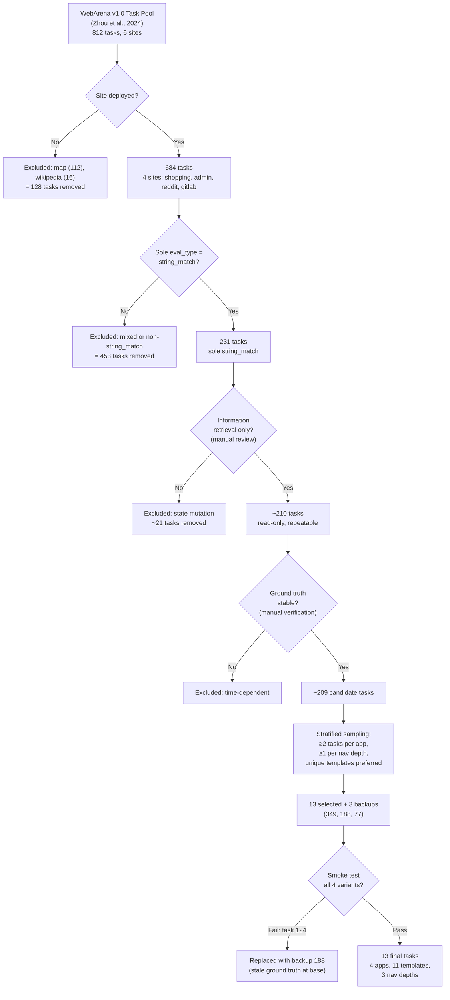

# §3.X Task Selection Protocol

## Flowchart (Mermaid)

## Prose (paper-ready, ~1 page)

### 3.X Task Selection

We selected 13 tasks from WebArena v1.0's 812-task pool [Zhou et al., 2024]
through a systematic six-stage filtering protocol designed to maximize
diversity while ensuring experimental validity (Figure X). Complete task
ID lists at each filtering stage are provided in the supplementary materials.

**Stage 1: Site availability.** We excluded tasks targeting map (112 tasks)
and wikipedia (16 tasks), which were not deployed in our WebArena instance,
retaining 684 tasks across four applications: Magento storefront (shopping,
192 tasks), Magento admin panel (shopping_admin, 182), Postmill forum
(reddit, 114), and GitLab (196).
We used WebArena Docker images with database snapshots frozen at deployment
time to prevent ground truth drift.

**Stage 2: Evaluation reliability.** We retained only tasks whose sole
evaluation type is `string_match` (exact substring matching). Of the 684
deployed tasks, 231 use string_match exclusively, 10 use string_match
combined with url_match (excluded to avoid mixed evaluation), and 443 use
only non-string_match types (program_html: 253, url_match+program_html: 129,
url_match: 61). This eliminates dependency on external LLM judges and
ensures deterministic, reproducible evaluation. 231 tasks remained.

**Stage 3: Repeatability.** Through manual review, we excluded tasks
requiring state mutation (e.g., creating posts, submitting forms),
file uploads, or cross-application navigation, as these introduce
non-deterministic server-side state that confounds repeated measurements.
Approximately 210 tasks remained. (Stages 3–4 involve subjective
judgment; counts are approximate ±5 based on the primary reviewer's
classification. Complete task-level annotations are in supplementary.)

**Stage 4: Ground truth stability.** We excluded tasks with time-dependent
answers (e.g., "most recent notification") or answers that did not match
the current database snapshot, verified through manual inspection against
the frozen Docker images. Approximately 209 candidate tasks remained.

**Stage 5: Stratified sampling.** From the remaining candidates, we selected
13 tasks plus 3 backup candidates (tasks 349, 188, 77) to maximize
coverage across three dimensions:

- **Application diversity**: 4 shopping_admin, 4 shopping, 2 reddit,
  3 gitlab (all four deployed applications represented)
- **Navigation depth**: 5 shallow (1–2 steps), 5 medium (3 steps),
  3 deep (4–5 steps)
- **Template independence**: 11 unique intent templates across 13 tasks
  (tasks 23, 24, and 26 share template 222, exercising the same product
  review page structure with different search terms; all other 10 tasks
  use distinct templates)
- **Page type diversity**: 11 distinct page types including product review
  tabs, search results, admin data grids, forum post lists, comment trees,
  repository contributor pages, and user account pages

**Stage 6: Smoke validation.** Each selected task was tested at all four
accessibility variants with a single repetition before full experiment
execution. We verified three criteria: (a) variant patches applied correctly
to the task's page type (DOM changes count > 0 for non-base variants),
(b) task-critical information — defined as the DOM element(s) containing
the ground-truth answer string — remained present in the accessibility tree
at each variant level (verified via manual trace inspection), and
(c) no platform errors (bridge crashes, timeout, evaluation failures)
occurred. Task 124 (price range query) failed criterion (b) at the base
variant: the expected answer did not match the current product catalog,
indicating stale ground truth. It was replaced with backup task 188
(cancelled order cost). All 13 final tasks passed smoke validation.

Table X summarizes the final task set with navigation depth and page type
annotations.

| ID | App | Nav Depth | Page Type | Template |
|----|-----|-----------|-----------|----------|
| 4 | admin | medium | Report table | 279 |
| 23 | shopping | shallow | Product reviews | 222 |
| 24 | shopping | shallow | Product reviews | 222 |
| 26 | shopping | shallow | Product reviews | 222 |
| 29 | reddit | medium | Comment tree | 33 |
| 41 | admin | medium | Dashboard widget | 285 |
| 67 | reddit | shallow | Post list | 17 |
| 94 | admin | deep | Invoice detail | 274 |
| 132 | gitlab | medium | Contributors table | 322 |
| 188 | shopping | shallow | Order history | 159 |
| 198 | admin | deep | Order filter grid | 366 |
| 293 | gitlab | medium | Clone panel | 329 |
| 308 | gitlab | deep | Contributors chart | 323 |
