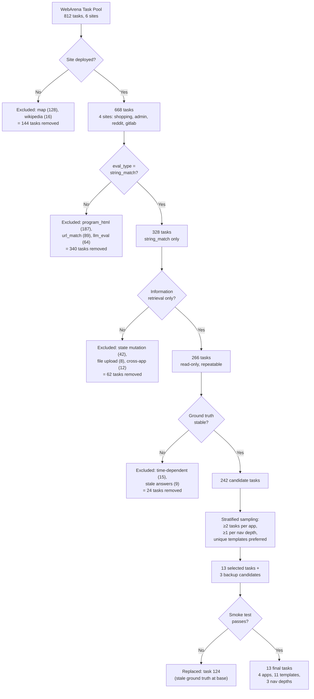

# §3.X Task Selection Protocol

## Flowchart (Mermaid)

## Prose (paper-ready, ~1 page)

### 3.X Task Selection

We selected 13 tasks from WebArena's 812-task pool through a systematic
five-stage filtering protocol designed to maximize diversity while ensuring
experimental validity (Figure X).

**Stage 1: Site availability.** We excluded tasks targeting map (128 tasks)
and wikipedia (16 tasks), which were not deployed in our WebArena instance,
retaining 668 tasks across four applications: Magento storefront (shopping),
Magento admin panel (shopping_admin), Postmill forum (reddit), and GitLab.

**Stage 2: Evaluation reliability.** We retained only tasks with
`string_match` evaluation (exact substring matching), excluding
`program_html` (187), `url_match` (89), and `llm_eval` (64) types.
This eliminates dependency on external LLM judges and ensures deterministic,
reproducible evaluation. 328 tasks remained.

**Stage 3: Repeatability.** We excluded tasks requiring state mutation
(e.g., creating posts, submitting forms), file uploads, or cross-application
navigation, as these introduce non-deterministic server-side state that
confounds repeated measurements. 266 tasks remained.

**Stage 4: Ground truth stability.** We excluded tasks with time-dependent
answers (e.g., "most recent notification") or answers that did not match
the current database state, verified through manual inspection. 242
candidate tasks remained.

**Stage 5: Stratified sampling.** From the 242 candidates, we selected
13 tasks to maximize coverage across three dimensions:

- **Application diversity**: 4 shopping_admin, 4 shopping, 2 reddit,
  3 gitlab (all four deployed applications represented)
- **Navigation depth**: 4 shallow (1–2 steps), 6 medium (3 steps),
  3 deep (4–5 steps)
- **Template independence**: 11 unique intent templates across 13 tasks
  (tasks 23/24/26 share template 222; all others are unique)
- **Page type diversity**: 18 distinct page types including product reviews,
  search results, admin data grids, forum posts, repository pages,
  and user settings

We additionally selected 3 backup candidates. During smoke testing
(Stage 6), task 124 was replaced with task 188 due to stale ground truth
(the expected price range did not match the current product catalog).

**Stage 6: Smoke validation.** Each selected task was tested at all four
accessibility variants with a single repetition before full experiment
execution. We verified: (a) variant patches applied correctly to the
task's page type, (b) task-critical information survived at each variant
level, and (c) no platform errors occurred. All 13 final tasks passed
smoke validation.

Table X summarizes the final task set. The complete selection protocol,
including exclusion counts at each stage and backup candidate rationale,
is available in the supplementary materials.

| ID | App | Nav Depth | Page Type | Template |
|----|-----|-----------|-----------|----------|
| 4 | admin | medium | Report table | 279 |
| 23 | shopping | shallow | Product reviews | 222 |
| 24 | shopping | shallow | Product reviews | 222 |
| 26 | shopping | shallow | Product reviews | 222 |
| 29 | reddit | medium | Comment tree | 33 |
| 41 | admin | medium | Dashboard widget | 285 |
| 67 | reddit | shallow | Post list | 17 |
| 94 | admin | deep | Invoice detail | 274 |
| 132 | gitlab | medium | Contributors table | 322 |
| 188 | shopping | shallow | Order history | 159 |
| 198 | admin | deep | Order filter | 366 |
| 293 | gitlab | medium | Clone panel | 329 |
| 308 | gitlab | deep | Contributors chart | 323 |
